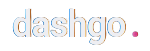

<div align="center">
  
</div>

Simple API to serve [dashgo](https://github.com/martinsvinicius/dashgo) app.

<hr />

## Features

- Users CRUD
- Authentication
- JWT and Refresh token

## Getting Started

<br />

<div align="center">
<b>This API was built to serve the web app dashgo, after you run it, open <a href="https://github.com/martinsvinicius/dashgo">dashgo</a> and follow the Getting Started topic on README</b>.
</div>

<br />

**Install the project dependencies**

```sh
yarn install
```

**Then, you can run the app:**

```sh
yarn dev
```

API endpoint: http://localhost:3333

<br />

**That's it. You successfully started the app**

<br />

## Author

<div align="center">
  

  <br />
  <b>Vinicius Martins</b>
  <br />
  <br />

  
  <a href="https://www.twitter.com/martnght/">
    
  </a>
  <a href="mailto:vinicius.victor.sm@gmail.com">
    
  </a>
  <a href="https://www.linkedin.com/in/vinicius5g">
    
  </a>
</div>
